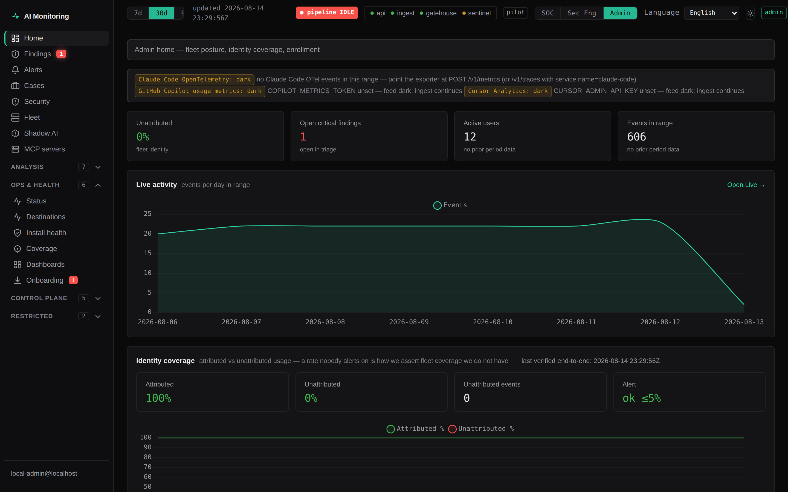
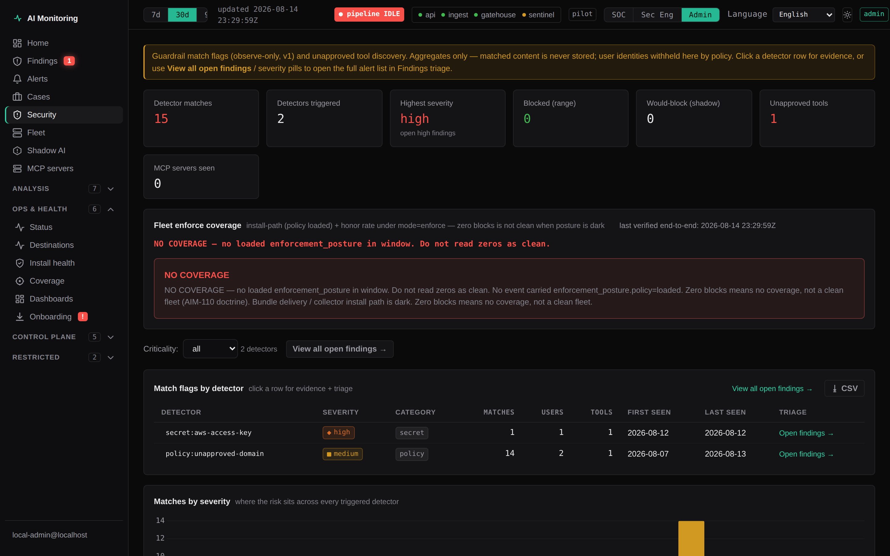
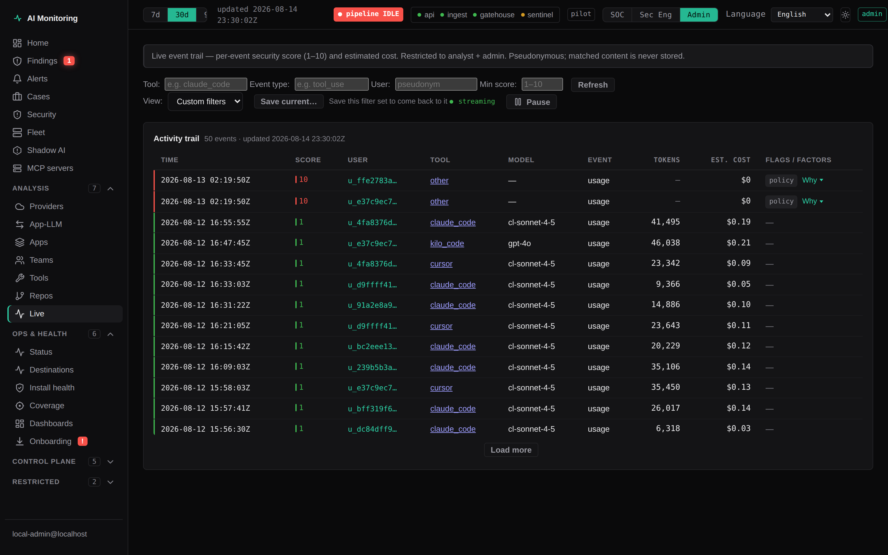
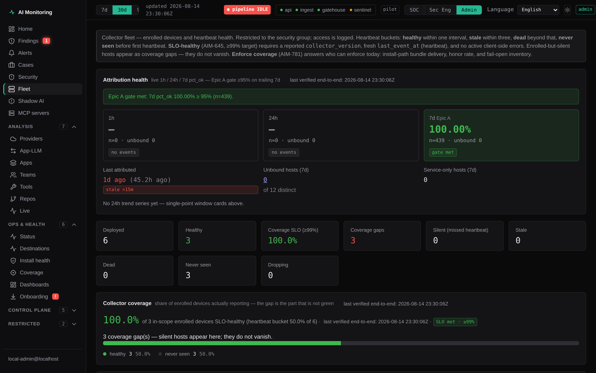
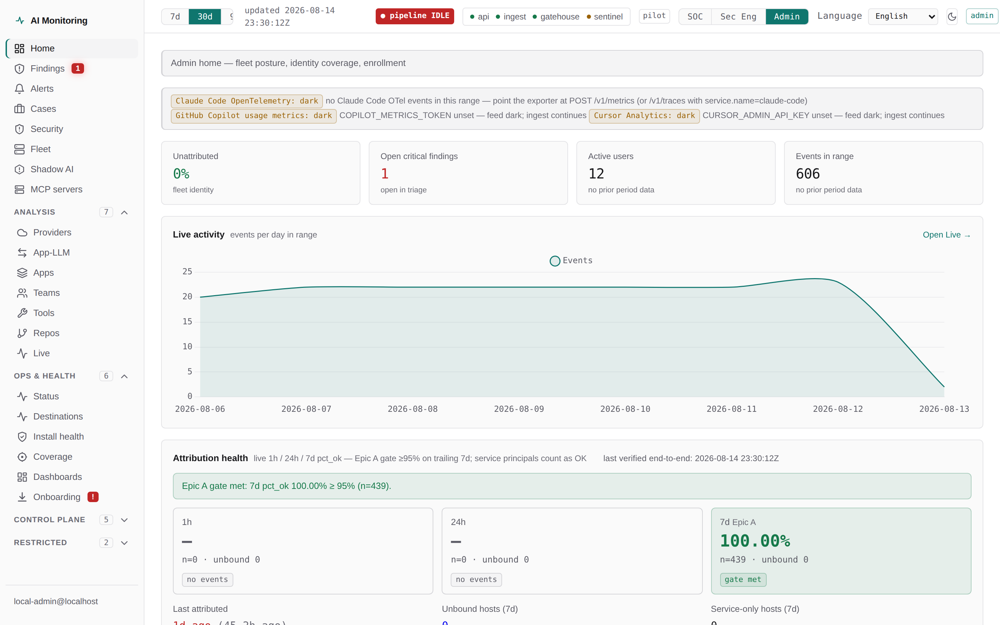

# AIM (AI Monitoring)

[](https://github.com/hawikk/aim/actions/workflows/ci.yml)
[](LICENSE)

See and guard every AI coding tool in your company. Privacy-first, self-hosted.

Community is **Apache-2.0** and free for personal projects and public open
source. Team and Enterprise talk to us:
[getaimonitoring.com](https://getaimonitoring.com).

This repo is the public Community clone. It ships endpoint collectors, ingest +
Postgres, a guardrail engine, identity-sync, shadow-AI discovery, Gatehouse
(free PR-security — not a CI/CD product), hygiene, an alert bus, the analyst
dashboard (`apps/web` + `apps/api`), the `aim` CLI, and Helm / Intune / Linux
install paths. Full map: [docs/architecture.md](docs/architecture.md).

**Docs:** [documentation index](docs/README.md) ·
[stack overview](docs/product/stack-overview.md) ·
[Gatehouse](docs/product/gatehouse.md).

This repository is a curated public snapshot of a larger internal monorepo.
It carries the code and the documentation you need to run and extend the
product; internal design notes, rollout records, and deployment-specific
compliance material are not published here, so a few cross-references in the
docs will not resolve.

| Tier | Price | How you start |
| --- | --- | --- |
| Community | Free (soft cap: 3 seats) | Clone this repo |
| Team | $12 / seat / mo annual | [sales@getaimonitoring.com](mailto:sales@getaimonitoring.com) |
| Enterprise | From $28 / seat / mo | [sales@getaimonitoring.com](mailto:sales@getaimonitoring.com) |

The 3-seat Community cap is a license line, not a download gate. SSO, paid
enforce packs, Sentinel, and evidence packs are commercial. The software in
this tree is not DRM-gated — same NetBird-style model as
[getaimonitoring.com/start.html](https://getaimonitoring.com/start.html).

```bash
git clone https://github.com/hawikk/aim.git
cd aim
./scripts/demo-stack-up.sh
# → http://127.0.0.1:8081  (personal/standalone local admin; no SSO)
```

Needs Docker. Target time-to-green is about 30 minutes on a laptop.

## The goal

Most engineering orgs have **no central view** of which AI coding tools are in
use, what they cost, or whether secrets / personal data are flowing into them.
AIM closes that with a **metadata-only** platform: collectors report
pseudonymized usage metadata; the dashboard turns it into fleet visibility and
security findings — without storing prompt text, code, or raw identities.
Platform findings are observe/alert by default. Enforcement is deliberately
narrow: the **Claude Code** hook is the only collector that can block, and only
for the managed secret-in-prompt bundle. The other five collectors are
observe-only (see Trust, and `collectors/parity-matrix.json`).

### Dashboard

Screenshots below are **live captures of the analyst console** at 2880×1800 @2×:
Home, Security, Live activity, Fleet, plus light theme. Source: a running
personal/standalone stack with synthetic data. Regenerate anytime with:

```bash
# apps/web has Playwright; demo dashboard is :8081 (or set AIM_BASE / --base)
cd apps/web && npx playwright install chromium   # once
node scripts/capture-readme-screenshots.mjs \
  --base http://127.0.0.1:8081 \
  --out ../../docs/screenshots
```



*Home — unattributed rate, open criticals, active users, events in range, live
activity chart, and identity-coverage health.*



*Security — detector match flags by name (aggregate counts only; matched
content is never stored), severity, enforce-coverage posture, unapproved tools.*



*Live activity trail — streaming per-event view with a 1–10 security score,
pseudonymous users, model, tokens, cost, and match flags.*



*Fleet — enrolled devices, collector coverage %, healthy / silent / dead /
never-seen, attribution health, and coverage SLO.*



*Same Home chrome in light theme (dark default above).*

## Install

Three ways in, from fastest local eval to a private-network pilot.

### 1. Self-host demo (one command)

For an engineer or small team evaluating the full stack on a laptop (loopback +
demo seed; not only personal mode):

```bash
git clone https://github.com/hawikk/aim.git
cd aim
./scripts/demo-stack-up.sh
# → http://127.0.0.1:8081
```

```bash
make demo-stack              # same script
make demo-stack-preflight    # Docker / ports / env only
```

Happy path, failure modes (missing Docker, port conflicts, secret placeholders),
health checks, optional Gatehouse pointers, and explicit non-goals:

**→ [`docs/deployment/self-host-quickstart.md`](docs/deployment/self-host-quickstart.md)**

This path is **self-hosted demo / small-team laptop eval**, not multi-tenant
SaaS and not a CI product. For a real private-network company pilot use
[Enterprise / private-network pilot](#3-enterprise--private-network-pilot)
below, or write [sales@](mailto:sales@getaimonitoring.com).

### 2. Personal mode — your own AI usage in 60 seconds

No company, no SSO, no Docker, no database. Install the single `aim` CLI and
watch **your own** Claude Code, Cursor, Kilo Code, Kimi Code, and Grok Build
usage on a local dashboard. Everything stays on your machine — **personal mode
makes zero outbound network calls** (verify by running it with networking off).
Requires only Python 3.11+ (standard library only).

```bash
pipx install aimonitoring-security
aim personal
# → open http://127.0.0.1:8787
aim --version   # e.g. "aim 0.1.1"
```

> **Do not run `pipx install aim`.** That PyPI name is AimStack's unrelated ML
> experiment tracker. Our distribution name is **`aimonitoring-security`**; the
> console script it installs is still **`aim`**.

```bash
aim personal                # scan once + serve the dashboard
aim personal --watch        # also re-scan every 30s while open
aim personal --port 9000
aim personal --scan-only    # just refresh the local store, no server
aim status                  # local, network-free: what's installed + queued
aim --version
```

Build the same wheel from this repo (offline / no PyPI):

```bash
python3 scripts/build_aim_cli.py
pipx install packaging/aim-cli/dist/aimonitoring_security-*-py3-none-any.whl
aim personal
```

See [`packaging/aim-cli/README.md`](packaging/aim-cli/README.md).

It reads your real local AI tool data — Claude Code transcripts
(`~/.claude/projects/**/*.jsonl`), Cursor's local state (`state.vscdb`),
Kilo Code task logs (`ui_messages.json`), and Kimi Code wire logs
(`wire.jsonl`) — and extracts **metadata only** (model, token counts,
session/repo pseudonyms — never prompt text or code). Secret/PII patterns are
matched **in memory** at scan time and discarded immediately; only detector
names (e.g. `secret:aws-access-key`) are stored as match flags. Everything
lands in a local SQLite file at `~/.aim-collector/personal.db`. The dashboard
binds `127.0.0.1` only. Single implicit local user; no auth.

Works on Windows / WSL / Linux / macOS.

### 3. Enterprise / private-network pilot

Company control plane on an EC2 / VM / NetBird overlay. **No manual env
exports.** Datastores stay loopback; app surfaces publish for collectors; demo
seed stays off. On success: health green + `enroll.sh` device one-liner.

Team and Enterprise commercial terms: write
[sales@getaimonitoring.com](mailto:sales@getaimonitoring.com). The installer
itself is in this repo:

```bash
git clone https://github.com/hawikk/aim.git
cd aim
./scripts/install-pilot.sh
# → ingest :8080 /healthz + dashboard :8081 /api/health = 200
# → prints: curl -fsSL http://…:8081/enroll.sh | bash -s -- --url … --token …
# Prefer prebuilt images when available:
#   AIM_IMAGE_TAG=main-<shortsha> ./scripts/install-pilot.sh --pull
```

```bash
make install-pilot              # prefer-pull; falls back to source build
make install-pilot-pull         # require prebuilt images
make install-pilot-build        # force source build
make install-pilot-preflight    # Docker / ports / disk hints only
```

| Default | Pilot value |
| --- | --- |
| `AIM_BIND_ADDR` | `0.0.0.0` |
| `AIM_DATASTORE_BIND_ADDR` | `127.0.0.1` |
| Demo seed | off |
| Corrupt Docker data-root | `./scripts/demo-stack-recover.sh` then re-run |

Air-gapped and backup/restore procedures:

**→ [`docs/deployment/air-gapped-install.md`](docs/deployment/air-gapped-install.md)** · **[`docs/deployment/backup-restore.md`](docs/deployment/backup-restore.md)**

## Join a fleet in one line (and keep it healthy)

On a managed machine, one command detects every installed AI tool, hooks the
hook-capable ones, enrolls the device once, verifies connectivity, and
registers a **per-user** background watcher so collection survives reboots:

```bash
aim join https://ingest.corp.example --token <scoped-enroll-token>
aim status                  # read-only: per-tool hook / enroll / heartbeat / spool
aim doctor                  # verify install health
aim doctor --fix            # repair: re-add clobbered hooks, restart service, drain spool
aim uninstall               # remove hooks, state, and the auto-start service (idempotent)
```

**Auto-start is per-user, never root.** `join` registers the watcher as a
systemd **user** unit (Linux), a launchd **LaunchAgent** (macOS), or a per-user
**Scheduled Task** (Windows) — nothing is written to a system/root scope, and
`aim` refuses to install a service as root.

**Survives the two silent-failure modes.** Watchers no longer die with a
terminal (the service restarts them across reboots), and when an AI tool's
update rewrites its own settings file and drops our hook, `aim doctor` detects
that clobber and `--fix` re-installs the hook **without losing any spooled
events**.

## Trust and privacy principles

**Auditor one-pager:** [`docs/privacy/auditor-privacy-overview.md`](docs/privacy/auditor-privacy-overview.md)
— two pages on the metadata-only posture plus offline verifier commands
(`scripts/no_content_egress.py`, compliance offline pack +
`scripts/verify-compliance-bundle.mjs`).

These are non-negotiable design constraints, enforced in code and tests:

- **Metadata-only telemetry.** The platform never stores prompt text, response
  text, or code content. The canonical schema uses `additionalProperties: false`,
  so any property named like `prompt`, `content`, `text`, or `code` is rejected.
  Detection results are boolean flags plus a detector name — never matched
  content. You can verify this yourself in this repo, without a running stack:
  `python scripts/no_content_egress.py` walks the whole invariant end to end
  (schema rejection, adapter strip-before-emit, and the ingest archive layer),
  and `--self-test` mutates each control to prove the checks still fail when
  they should. `pnpm --filter @aimon/ingest test` runs the schema and archive
  suites, including canaries for content smuggled through property names and
  `schema_version`. Both run in CI.
- **Pseudonymization at the edge.** `user_ref`, `host_id`, `team_ref`, and
  `repo_ref` are salted HMACs produced by collectors. Raw identity never
  leaves the endpoint; the salt lives outside this platform, so stored data
  cannot be reversed by the platform itself (EU / works-council posture).
- **Data minimization.** Only the fields in the canonical schema exist, each
  with a documented privacy justification (`packages/schema/README.md`).
  Rejected payloads are audited by SHA-256 hash and key names only — never
  stored raw.
- **Split enforcement posture.** The **platform** guardrail engine is
  detect-and-alert only — every finding carries `decision: "observe"`. That is
  intentional and must not be read as "we do not enforce." The **Claude Code**
  endpoint hook — the only collector with a blocking interception point — applies
  the managed `enforcement.json` bundle (`mode: enforce` for
  `secret-pattern-in-prompt` only; other rules stay shadow). Cursor, Kilo Code,
  Kimi Code, Grok Build and GitHub Copilot are observe-only; see
  `collectors/parity-matrix.json` for the per-collector capability matrix. Real blocks and
  shadow decisions are audited on usage events as
  `enforcement: {action, rule_id, policy_hash}` (`blocked` | `would_block` |
  `confirmed`). A missing bundle fail-opens to observe. **Fleet enforce
  coverage:** `#/fleet` and `GET /api/enforcement/coverage` show install-path
  coverage, honor rate, and fail-open inventory so SOC can answer "who can
  enforce today?" without SQL.
- **Retention is enforced, not aspirational.** Every store ages itself out by
  data class — events 90d, findings 365d, audit trail 730d by default, with
  `audit ≥ findings ≥ events` enforced. The ingest service purges Postgres in
  bounded batches on a schedule; personal mode prunes its local SQLite store.
  A bad config fails closed (skips + logs, never guesses). Knobs:
  `RETENTION_EVENTS_DAYS` / `RETENTION_FINDINGS_DAYS` /
  `RETENTION_AUDIT_DAYS` / `RETENTION_DRY_RUN` / `RETENTION_INTERVAL_HOURS` /
  `RETENTION_BATCH_SIZE` (see `.env.example` and
  `docs/privacy/data-minimization-and-pseudonymization.md`).

## Architecture

Path of record, component table, and data-flow detail:
**[docs/architecture.md](docs/architecture.md)** (kept current; this section is a sketch).

```
 endpoints / CI                         network / IdP
 ┌────────────────────┐               ┌──────────────────┐
 │ aim join + hooks   │               │ proxy / os-egress│
 │ claude/cursor/…    │── events ────▶│ shadow-ai IdP    │── events ──┐
 │ aim watch (user)   │  metadata     └──────────────────┘ metadata   │
 └────────────────────┘  only                          only           │
        │                                                              ▼
        └──────────────▶ services/ingest (auth + schema + Postgres + archive)
                                  │
              ┌───────────────────┼───────────────────┐
              ▼                   ▼                   ▼
         apps/api            guardrail            gatehouse / hygiene
         apps/web            findings             PR + full-history scans
              │                   │
              └──────── alert bus ┴──▶ sentinel / SIEM
```

1. Collectors and proxy pipelines emit **metadata-only** events (or match
   flags only for secrets/PII).
2. Ingest authenticates, validates against the schema
   (`additionalProperties: false`), writes Postgres + optional archive.
3. Guardrail evaluates events against `policies/guardrail/v1/core.yaml`.
4. Findings surface in the dashboard; high-value signals can page via the
   alert bus when destinations are configured.
5. Gatehouse publishes onto the same `security.alert` bus shape where wired.

```
Personal mode (aim personal)     Demo stack (demo-stack-up.sh)     Company pilot
  local SQLite, :8787              loopback compose, :8081           install-pilot.sh
  zero outbound                    seeded eval                       private network
```

## Repo layout

```
apps/api                 Dashboard API (SSO/RBAC, findings, fleet, coverage, …)
apps/web                 Analyst console (static ES modules + views)
apps/landing             Public product page
services/ingest          Enroll / heartbeat / events (Postgres + object archive)
services/guardrail       Post-ingest policy engine → findings
services/gatehouse       Free PR-security pillar (Semgrep/Gitleaks/Checkov/Trivy)
services/sentinel        Alert bus consumer / triage / optional draft PRs
services/hygiene         Full-history secret hygiene
services/identity-sync   Directory join + pseudonym reveal
services/shadow-ai       IdP OAuth / SaaS grant inventory
collectors/*             Endpoint + proxy collectors (claude, cursor, kilo, kimi, grok, …)
packaging/aim-cli        `aim` CLI (join / watch / doctor / personal)
packages/schema          Canonical event / alert / finding contracts
policies/                Guardrail + MCP + compliance policy-as-code
deploy/                  Helm, Linux/Windows/macOS, Intune, enforcement bundles
docker-compose.yml       Full local stack (dashboard typically :8081)
docs/architecture.md     Component map + path of record
```

## Dev quickstart

Prereqs: Node 20+ (`nvm use`), pnpm 9 (`corepack enable`), Docker.

```bash
pnpm install
pnpm build
npm ci --prefix apps/api   # apps/api is npm-managed (own lockfile)
pnpm typecheck
pnpm lint
```

`pnpm test` is **not** usable in this snapshot: `services/ingest` runs
`vitest run`, and the workspace test files are not part of the public export,
so vitest exits non-zero on "no test files found". Run the suites listed under
[Tests in this snapshot](#tests-in-this-snapshot) instead.

### Tests in this snapshot

> **Heads up:** this public repo is a snapshot of a larger internal monorepo and
> **does not carry most of the per-collector and per-service `tests/`
> directories**, so `pytest collectors/...` will collect nothing here. The one
> deliberate exception is `services/ingest/test/`, which carries the schema and
> archive suites because they are the executable proof of the metadata-only
> claim above. What *is* present and running in CI is listed below.

The collectors are pure-stdlib Python; the services declare their deps in
their own `pyproject.toml`.

```bash
pip install -r requirements-dev.txt   # pytest + jsonschema + editable services

python -m pytest scripts -q                 # enrol script + DPIA exporter
python packages/schema/validate.py          # canonical schema + conformance corpus
python scripts/build_aim_cli.py             # `aim` wheel + sdist (stdlib only)
node --test scripts/test_compose_bind.mjs   # compose never binds 0.0.0.0
node --test scripts/test_compose_pull.mjs   # pilot pull-override contract
pnpm lint && pnpm typecheck                 # after `pnpm install`
```

The full set of checks that gate `main` is in
[`.github/workflows/ci.yml`](.github/workflows/ci.yml); see
[CONTRIBUTING.md](CONTRIBUTING.md) for the rest of the contributor workflow.

### View the dashboard

Prefer the one-command path (preflight + mint env + up + health + seed):

```bash
./scripts/demo-stack-up.sh            # or: make demo-stack
# → http://127.0.0.1:8081
```

Manual equivalent:

```bash
python3 scripts/ensure_dev_env.py
docker compose up -d --build
SEED_BASE_URL=http://localhost:8080 ./scripts/seed-pilot-cohort.sh
# open http://localhost:8081
```

The stack opens on **http://localhost:8081** with a local admin identity
(personal/standalone mode — no `AIM_OIDC_*` set). SSO is only wired for a
company deploy. `identity-sync` loads the fixture directory at startup so team
attribution works out of the box. `guardrail` polls `evaluate-db` on an
interval, so the Security view populates as events flow.

Notes:

- **Every published port binds `127.0.0.1` by default.** Nothing is reachable
  from your network until you say so. To let collectors on *other* machines
  reach ingest, set `AIM_BIND_ADDR=0.0.0.0` in `.env`. That knob is separate
  from `AIM_DATASTORE_BIND_ADDR`, so widening the app surfaces never widens
  the telemetry database. See `.env.example`.
- If you run Docker in WSL2 and browse from Windows, `localhost:8081` forwards
  to the distro's loopback automatically. The WSL IP does not — that address
  is no longer bound, which is the point.
- A blank page at `localhost:8081` almost always means the stack isn't running
  on *that* machine — `docker compose ps` should show `api` as `Up`.

## Security defaults

- No secrets in the repo: tokens/passwords come from env vars; `.env` files
  are gitignored (only `.env.example` is committed).
- Bearer tokens for ingest come from `INGEST_TOKENS` (comma-separated) and
  are compared in constant time; `Authorization` headers are redacted from
  logs.
- Containers run as a non-root user (`node`).
- The ingest service logs ids and counts only — never event payloads — and
  validation errors never echo payload values back to callers.
- Database writes are parameterized; ingest is idempotent on `event_id`
  (`ON CONFLICT DO NOTHING`).

## Platform access (SSO + RBAC)

The dashboard API (`apps/api`) terminates SSO itself: with `AIM_OIDC_*` set
it runs an in-app OIDC authorization-code flow (PKCE, HMAC-signed HttpOnly
session cookie) and maps the ID token's groups claim to roles via
`AIM_ROLE_GROUPS_*`. **No authorization decision ever derives from a
client-supplied header** — `X-Forwarded-*` / `X-AIM-*` identity headers are
never read; there is no proxy-auth mode. With no `AIM_OIDC_*` set the API
runs in personal/standalone mode (a single local admin identity), which must
never be exposed beyond localhost.

Four roles, enforced in `apps/api/src/auth.js`:

- **viewer** — org/team aggregates and dashboards only: no per-engineer
  rows, no findings, no audit trail.
- **auditor** — read-only: dashboards, compliance views, and the access
  audit trail.
- **analyst** — dashboards, findings console, user-level rows, fleet,
  coverage — no guardrail config, no audit trail.
- **admin** — everything, including repo de-pseudonymization labels and
  guardrail configuration.

Groups come from `AIM_ROLE_GROUPS_ADMIN` (default `ai-monitoring-security`),
`AIM_ROLE_GROUPS_ANALYST`, `AIM_ROLE_GROUPS_AUDITOR`, and
`AIM_ROLE_GROUPS_VIEWER` (default `ai-monitoring-viewers`). An authenticated
user whose groups map to no role gets zero access — fail-closed.
**Viewer is an explicit group grant**, not an implicit default. Identity
reveal is **not** a role and is not bundled into admin: it is a separate
capability from `AIM_REVEAL_GROUPS` (default `ai-monitoring-revealers`).
See `docs/identity-mapping-design.md`.

### Service tokens (headless consumers)

Browser identity comes from the `aim_session` cookie. Daemons use a
non-interactive credential:

```bash
node scripts/mint-service-token.mjs sentinel --role analyst
```

That prints the secret once and the entry to add to the file named by
`AIM_SERVICE_TOKENS_FILE`. The file stores **sha256 digests, not secrets**.
Consumers authenticate with `Authorization: Bearer <secret>`.

- A service token may not hold `admin` — only `viewer`, `analyst`, or
  `auditor`. A disallowed role is rejected at load, never quietly downgraded.
- A `Bearer` header is authoritative: it resolves to a service identity or
  401s. It does not fall through to the cookie/personal paths.
- A configured-but-unparseable token file is a fatal boot error.

## License

Apache License 2.0. See [LICENSE](LICENSE).

“AIM” and “AI Monitoring” are trademarks of AI Monitoring.

Site: [getaimonitoring.com](https://getaimonitoring.com) ·
Security: [security@getaimonitoring.com](mailto:security@getaimonitoring.com)
