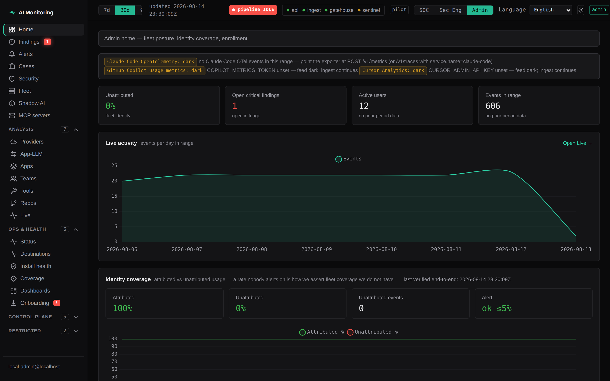

# Frontend design system

Source of truth: `apps/web/public/styles.css`. This document describes the token
layers, the component catalog, and the theming decision. Keep the two
in sync — if you change one, change the other.

The dashboard is a no-build static app (plain CSS + ES modules + vendored
Chart.js), so the design system is intentionally CSS-only: custom properties
for tokens, BEM-ish flat class names for components. No framework, no
preprocessor.

Adding a new view? Follow `docs/how-to-add-dashboard-view.md` (Phase
2) — the router/module wiring checklist, the shared-kernel import rule, and
the smoke guard that enforces both.

## Principles

- **Token-first.** Components reference semantic tokens (`--panel`, `--text`,
  `--accent`), never color primitives or raw hex. New one-off colors are a
  review finding.
- **Dark-first, themeable.** Dark is the default theme (see decision below);
  light is a token override block, not a second stylesheet.
- **Security-product tone.** Mission-control aesthetic: dense data, restrained
  color, status hues reserved for meaning (good/bad/warn), not decoration.
- **Accessible by default.** `:focus-visible` rings everywhere,
  `prefers-reduced-motion` kills animation, status is never color-only
  (pills carry a dot + label, toasts carry text).

## retoken: what changed and why

The system was structurally sound (tokens, semantic layer, light
override) but its surface read as a consumer AI product rather than a security
console: a blue→violet brand gradient, gradient-clipped stat numerals, an
ambient page glow, a backdrop-blurred top bar, 14px card radii, pill buttons,
and emoji in every empty state. kept the architecture and replaced the
surface. The rules below are enforced by tests in `apps/web/test/smoke.test.js`
— violating them fails CI, which is deliberate: each one is cheap to
reintroduce a single component at a time.

**Surfaces.** Near-black neutral (`#0A0A0B`), surface one step lighter, 1px
hairline borders instead of shadows. Shadows exist only on floating layers
(modals, toasts, popovers).

**One accent.** Desaturated teal `#2DD4A8` for primary actions and active nav
only, with `--accent-solid` (`#25B892`) for filled surfaces. Teal is a *light*
accent, so label text on a filled accent surface is near-black
(`--accent-contrast: #04140F`, 7.5:1) — never white, which would sit at 1.9:1.
Light mode inverts this: the accent deepens to `#0F766E` and
`--accent-contrast` returns to white. That deep teal is pulled toward cyan
deliberately, because at light-mode lightness a truer teal converges on
`--good` and the accent must never read as a healthy status.

Everything else is semantic — red critical, amber warning/stale, green
healthy/sanctioned, neutral gray informational. A chart series never
introduces a new hue.

**Monospace for all data.** Pseudonym refs, token counts, costs, latencies,
timestamps, detector names and collector versions render in `--mono` with
`tabular-nums`. Sans is for chrome only. This single rule does most of the work
of making the console read as instrumentation.

**One timestamp vocabulary.** Every analyst-facing timestamp
renders through `fmtTs` in `apps/web/public/lib/format.js`. The shape is
fixed:

```
2026-07-30 00:00:00Z
```

- **Second precision** — pasteable into SIEM / collector logs (Splunk, etc.)
  without losing the correlation second.
- **Trailing `Z`** — the UTC claim is explicit; the reader never has to know
  that we always store UTC.
- **Space separator, no millis** — table-scannable; full original ISO value
  stays in the cell `title` attribute.

Do **not** reimplement `fmtTs` in a view module. Local copies historically
drifted to minutes+`Z` (`coverage.js`, `shadow-ai.js`) or seconds without `Z`
(`compliance.js`); the same instant then read differently depending on which
tab an analyst was on. Smoke test `one timestamp vocabulary via lib/format.js
fmtTs` fails CI if a local copy returns.

**Pseudonyms are a feature, not a defect.** `refCell()` renders a salted-HMAC
ref in mono, truncated to 10 characters, with the full value on the clipboard
on click and a tooltip that explains *why* it is truncated. A reviewer must
never read a pseudonym as a broken field or as a redaction to escalate.

**Density.** Strict 4px spacing grid, 6px radius ceiling, 28px table rows,
type scale 12/13/14/16/20/24.

**Motion.** 150ms ease-out, no transforms. Keyframes may fade; they may not
translate. `prefers-reduced-motion` disables them. The live trail fades new
rows in and never slides — a stream that jumps cannot be read.

**Banned outright.** Gradients of any kind, glows, backdrop blur,
gradient-clipped text, pill radii, emoji, and marketing copy inside the
product. Empty states state the situation and, where one exists, the exact next
command (Fleet's empty state prints `aim join --token <enrollment-token>`).

**Fonts are local-only.** Inter and JetBrains Mono are named first in the
stacks and the platform faces are the fallback. This console makes no
third-party font requests, which is a network-posture requirement, not a
preference.

### KPI deltas

The Overview KPI strip compares against the immediately preceding window of
equal length, served by `previousTotals` on `GET /api/overview`. It is a
separate aggregate, not arithmetic on a wider window, because distinct counts
(users, hosts, sessions) cannot be derived by subtraction. Rendering rules: a
zero prior period reads "no prior period data" rather than a fabricated +100%;
an unchanged metric says so rather than "0.0%"; and direction is colored only
where direction has meaning (cost rising is bad, token volume rising is not).

## Theming decision: `data-theme` attribute, dark default

**Decision: support a light theme via `<html data-theme="light">`; dark stays
the default. Not dark-only.**

Rationale:

- All colors were already custom properties after the redesign, so the
  marginal cost of light mode is a single override block (~50 lines), not a
  parallel stylesheet. That is cheap enough to be worth it.
- The dashboard is projected in ops/security review settings and embedded in
  wikis where dark-only reads poorly; a light option removes a real adoption
  complaint for an internal security tool.
- Dark-only would be simpler still, but the token architecture already
  absorbs the complexity — rejecting light mode would save almost nothing.

How it works:

- `:root` defines the dark theme (default, no attribute needed).
- `[data-theme="light"]` overrides **semantic tokens only**. Component rules
  are shared, so components cannot drift between themes.
- `color-scheme: dark|light` is set per theme so native scrollbars, form
  controls, and autofill match.
- Chart colors are **token names**, resolved at draw time (`cssVar()` in
  `app.js`). A dataset carries `token: '--good'`; series that pass nothing take
  `PALETTE` by index. Nothing captures a hex at import, which is what makes a
  runtime switch possible.

### Switching themes at runtime

The top bar carries a theme toggle (`#theme-toggle`), so an analyst switches
theme without a reload and without the host page's involvement.

- **Runtime control** is `public/lib/theme.js`: `initThemeToggle()` (called at
  app boot, *before* the session fetch, so the toggle still works on the
  "couldn't load your session" banner), `applyTheme()`, `toggleTheme()`.
- **Persistence** is `localStorage['aim.theme']` (`'dark' | 'light'`). Unset,
  unreadable, or unrecognized → dark. Storage access is best-effort: a
  partitioned or storage-disabled embed gets dark rather than an exception.
- **No flash.** A small inline script in the `<head>` of `index.html`, before
  the stylesheet, applies the stored theme pre-paint — a module script is
  deferred, and a deferred theme is a visible flash. That snippet and
  `theme.js` must keep the same key and value vocabulary; `test/theme.test.js`
  asserts it.
- **Charts re-theme live.** `applyTheme()` dispatches `aim:themechange` on
  `window`; `app.js` re-applies the Chart.js defaults, re-resolves every live
  chart's token colors and grid, and calls `update('none')`. Charts keep their
  data — a theme switch re-fetches nothing.
- **Other tabs follow.** A `storage` listener echoes the change into every open
  dashboard tab.
- **Accessibility.** The toggle is a button with `aria-pressed` and a stable
  accessible name ("Light theme"); the `title` says what the click will do, and
  the change is announced through `#sr-status`.

The same Overview, one click apart — dark (default) and light. Note that the
chart, its grid and its axis text move with the tokens; nothing here was
reloaded.




Anything else that caches a computed token value must listen for
`aim:themechange` too, rather than adding a hook to `theme.js`.

A host page embedding the dashboard can still pin a theme by setting the
attribute before first paint (the toggle then overrides it for that operator):

```html
<html lang="en" data-theme="light">
```

## Token reference

### Color primitives

Named hues (`--blue-400`, `--violet-400`, `--green-400`, `--red-400`,
`--amber-400`, `--cyan-400`, `--ink-700..900`, `--haze` rgb triplet).
**Never referenced by components directly** — they exist so semantic tokens
have a single place to point at.

### Semantic colors

| Token | Purpose |
|---|---|
| `--bg`, `--bg-soft` | Page background; sunken inputs |
| `--panel`, `--panel-solid`, `--panel-hover` | Translucent card/panel fill; opaque variant (sticky headers, modals, toasts); hover state |
| `--border`, `--border-strong`, `--border-subtle` | Default outline; hover/emphasis; table row separators |
| `--text`, `--muted`, `--faint` | Primary; secondary/labels; placeholders & timestamps |
| `--accent`, `--accent-2`, `--accent-soft`, `--accent-contrast` | Brand accent, gradient end, selected-state tint, text on accent |
| `--good`, `--bad`, `--warn` | Status hues — meaning only, not decoration |
| `--grad` | Brand gradient (accent → accent-2) |
| `--overlay` | Modal backdrop scrim |
| `--scrollbar` | Scrollbar thumb |

### Status tints

`--{good,bad,warn}-soft` / `--{good,bad,warn}-border` for pill/badge fills and
rings; `--warn-text`, `--info-soft`, `--info-border`, `--info-text` for
banners. Light theme re-tunes all of these for contrast on white.

### Severity — the one scale

Severity/criticality is the product's primary axis. There is **one** definition
of it, in `apps/web/public/lib/severity.js`, and every place that shows a
severity calls `severityBadge()`. Nothing hand-writes `class="pill sev-…"`
(a test in `test/severity.test.js` fails the build if a view starts to).

```js
import { severityBadge, severityBand, compareSeverity, severityColors } from './lib/severity.js';

severityBadge('critical')                                  // the badge
severityBadge('catastrophic', { id: 5, label: 'catastrophic' })  // banded by severity_id, label kept
severityBadge(d.severity, { source: d.severitySource })    // 'reported' → measured; anything else → dashed "inferred"
severityColors(['critical', 'high'])                       // chart colours, same --sev-* tokens
```

**Bands, loudest first:** `critical > high > medium > low > informational`.
Ordering lives in `SEVERITY_RANK`; sort with `compareSeverity`, never with a
local rank object. `informational` ranks **0**, so test membership
(`band in SEVERITY_RANK`), never truthiness.

**An unrecognised severity bands to `medium`, not `low`.** Rounding an unknown
risk down is how a real critical goes unlooked-at.

**Colour is the third channel, never the only one.** The ramp is
red → orange → amber → gray, and it does not clear the CVD separation floor in
either theme — measured with the `dataviz` validator (Machado-2009):

| theme | surface | worst all-pairs ΔE | pair |
|---|---|---|---|
| dark | `#141416` | 9.7 (deuteranopia) | medium ↔ high |
| light | `#fafafa` | 4.9 (deuteranopia) | medium ↔ critical |

This is structural, not a bad colour pick: any red/orange/amber ordinal ramp
converges under deuteranopia, and pulling the steps apart runs into the AA
text-contrast floor these pills need. So every badge carries two non-colour
channels — the **band name in text**, always, and a **per-band shape**
(`[data-sev]::before`: triangle critical, diamond high, square medium, dot low,
hollow ring informational). Do not build a severity affordance that drops both.

*Open question: a ramp built from unrelated hues would validate,
but would stop reading as an ordinal risk scale to everyone else. That trade is
a design-system decision, not a refactor's to make — raised here, not taken.

**Pill contrast, AA on the badge's own tint** (measured, not assumed):

| band | dark | light |
|---|---|---|
| critical | 4.68:1 | 4.85:1 |
| high | 4.63:1 | 5.96:1 |
| medium | 5.84:1 | 4.95:1 |
| low / informational | 5.33:1 | 5.50:1 |

retuned two light-theme steps to get there: `--sev-high`
`#b4530f → #9a3412` (the high/medium pair was ΔE 2.3 — indistinguishable) and
`--sev-medium` off `--warn` to `#8a5a05` (its pill text was 4.29:1, under AA).
`--sev-medium` is deliberately no longer an alias of `--warn`.

**Status colours are reserved.** No `--sev-*` token may be seated in the
categorical chart palette. *Known and not yet fixed:* `PALETTE` slots 3 and 4
(`--warn`, `--bad`) still share hues with `--sev-medium` / `--sev-critical`;
untangling that means re-picking the categorical ramp across every chart.

### Emphasis & ambient

- `--value-grad`, `--value-grad-good`, `--value-grad-bad` — gradient text fill
  for big stat values (`.card .value`).
- `--bg-glow` — the fixed ambient radial-gradient backdrop (`.bg-glow`).

### Chart hooks

`--chart-grid`, `--chart-tooltip-bg`, `--chart-tooltip-border`,
`--chart-tooltip-title`, `--chart-tooltip-body`. Read once at startup by
`app.js` (`cssVar()`), which also builds the series `PALETTE` from
`--accent`, `--good`, `--warn`, `--bad`, `--accent-2`, `--cyan-400`.
New chart colors must go through these tokens so both themes stay correct.

### Type scale

System font stack (`--font`): `-apple-system, BlinkMacSystemFont, "Segoe UI",
Inter, Roboto, "Helvetica Neue", sans-serif`. Numbers are `font-variant-numeric:
tabular-nums` in stat values, tables (`.num`), and timestamps.

| Token | Size | Used for |
|---|---|---|
| `--text-2xs` | 10px | Tags, overlines |
| `--text-xs` | 11.5px | Table headers, card labels, chart ticks, timestamps |
| `--text-sm` | 12.5px | Panel titles, secondary text, segmented controls |
| `--text-md` | 13.5px | Nav items, buttons, inputs, toasts |
| `--text-base` | 14px | Body |
| `--text-lg` | 15.5px | Brand name, modal titles |
| `--text-xl` | 26px | Stat card values |

Weights in use: 400 (body), 500 (nav/inputs), 600 (labels/buttons), 650
(panel/table headers), 700–750 (brand, stat values).

### Spacing scale

`--space-1..6` = 4 / 8 / 12 / 16 / 20 / 24px. Use the scale for **new**
components. Legacy components keep their tuned values (e.g. panel
padding `18px 20px`); migrate opportunistically, don't churn.

### Radii, elevation, motion, z-index

- Radii: `--radius-sm` 8, `--radius-md` 10, `--radius` 14 (cards/panels),
  `--radius-full` 999 (pills, tags).
- Elevation: `--shadow` (panels, modals, toasts). Glow accents on
  brand-gradient elements are hardcoded per-component by design.
- Motion: `--dur-fast` 0.15s (hover), `--dur-med` 0.28s (view/modal
  entrance), `--ease`. All killed under `prefers-reduced-motion`.
- Z-index: `--z-topbar` 10, `--z-overlay` 90 (modal backdrop),
  `--z-modal` 100, `--z-toast` 110.

## Component catalog

### Buttons — `.btn` + variant

```html
<button class="btn btn-primary">Save policy</button>
<button class="btn btn-ghost">Cancel</button>
<button class="btn btn-danger btn-sm">Revoke token</button>
```

Variants: `btn-primary` (brand gradient, one per view max), `btn-ghost`
(default secondary), `btn-danger` (destructive). `btn-sm` for dense toolbars.
`:disabled` is styled; always disable rather than hide unavailable actions.

### Form controls — `.input`, `select`, `.field`

```html
<div class="field">
  <label class="field-label" for="team">Team name</label>
  <input class="input" id="team" placeholder="e.g. platform-eng" />
  <span class="field-hint">Must match the IdP group name.</span>
</div>
```

`.input` and native `select` share one visual treatment. `.field` stacks
label/control/hint. `.picker` is the inline `label + select` pattern used in
toolbars.

### Modals — `.modal-backdrop` > `.modal`

```html
<div class="modal-backdrop">
  <div class="modal" role="dialog" aria-modal="true" aria-labelledby="m-title">
    <h3 class="modal-title" id="m-title">Reveal identity</h3>
    <p>…</p>
    <div class="modal-actions">
      <button class="btn btn-ghost">Cancel</button>
      <button class="btn btn-primary">Confirm</button>
    </div>
  </div>
</div>
```

Backdrop scrims and blurs the page, centers the dialog; JS owns open/close
(remove the backdrop node) and focus management.

### Toasts — `.toast-stack` > `.toast`

```html
<div class="toast-stack" aria-live="polite">
  <div class="toast ok">Policy saved.</div>
  <div class="toast bad">Ingest API unreachable — retrying.</div>
</div>
```

One fixed `.toast-stack` bottom-right; append/remove `.toast` nodes from JS.
Variants `ok` / `bad` / `warn` recolor the left edge; default (no variant) is
neutral accent. Toasts auto-dismiss in JS — the CSS intentionally has no
timeout.

### Existing components (unchanged API)

- **Topbar** `.topbar` > `.brand` (`.brand-mark`, `.brand-name`, `.tag`),
  `nav button` (`.active`), `.controls` (`.me`, `.updated`).
- **Segmented control** `.segmented button` (`.active`) — time ranges, source
  filters.
- **Stat cards** `.cards` > `.card` (`.label`, `.value`, optional
  `.tone-good`/`.tone-bad`).
- **Panels** `.panel > h2` (+ optional `.hint`) wrapping `.chart-box` or
  `.table-wrap`.
- **Tables** `.table-wrap > table`, `.num` for right-aligned tabular numbers.
- **Pills** `.pill.ok|bad|warn` status badges. Severity pills are NOT written
  by hand — call `severityBadge()` (see "Severity — the one scale").
- **Banners** `.banner.warn|info` inline notices (privacy/policy context).
- **Skeletons** `.skel` + `.panel.loading` for fetch states.

### Empty & error states

```html
<div class="empty-state" role="status">
  <div class="empty-icon" aria-hidden="true">🛠</div>
  <div class="empty-title">No AI tool usage yet</div>
  <div class="empty-body">No events were collected in this time range. …</div>
</div>

<div class="error-banner" role="alert">
  <div><strong>Couldn’t load this view.</strong> <span class="err-detail">…</span></div>
  <button class="btn btn-danger btn-sm">Retry</button>
</div>
```

- **Empty states** `.empty-state` (`.empty-icon`, `.empty-title`, `.empty-body`)
  replace bare "No data" cells. Copy is per view (see `EMPTY` in `app.js`) —
  say what "nothing" means and what to do next. Charts swap to an empty state
  via `setChartState()` instead of rendering empty axes.
- **Error banners** `.error-banner` are inline, retryable (`showError()` in
  `app.js`), announced via `role="alert"`. View loads also update the
  `#sr-status` polite live region.
- **A11y helpers** `.sr-only` (visually hidden, screen-reader only) and
  `.skip-link` (first tab stop, jumps to `#main`).

### Accessibility baseline (audit)

- Text on tinted surfaces must hold WCAG AA (4.5:1 normal, 3:1 large/UI).
  Token values were tuned to pass in both themes — check contrast before
  changing `--faint`, `--accent-contrast`, light-theme `--good/--bad/--grad`.
- Tabs use the ARIA tabs pattern (`role="tablist/tab/tabpanel"`, arrow keys);
  segmented controls expose `aria-pressed`; tables get `scope` + sr-only
  `<caption>`; canvases are `role="img"` with a data-summary `aria-label`;
  scrollable `.table-wrap` is a focusable labelled `role="region"`.

### WCAG target and keyboard investigation path

**Agreed target: WCAG 2.1 Level AA** for the shipped analyst UI in `apps/web`.
This is a shipping requirement, not a stretch goal. Scope notes:

| In scope | Out of scope (for now) |
| --- | --- |
| Keyboard operability of every interactive control in nav, filters, tables, findings triage, cases, and shared components | Full WCAG 2.2 / AAA |
| Focus order = DOM order (no positive `tabindex`) | Third-party Chart.js canvas internals beyond `role="img"` + summary |
| Contrast AA on design tokens in light and dark themes | PDF/export artifacts outside the web app |
| Screen-reader names for severity, status, expand/collapse, destructive actions | Automated axe scans of every view on every PR (tracked as follow-up hygiene) |

**Certified path — findings triage (keyboard only):**

1. Skip link → main, or Tab into `#tabs` and arrow/activate **Findings**.
2. Tab through Status / Severity / saved-view filters (native labelled controls).
3. Tab to a finding row button; **Enter** or **Space** expands the disclosure
   (`aria-expanded` / `aria-controls` / named panel). Focus moves into the
   triage note. The shared live region announces open/close.
4. Tab through evidence links (runbook, entity deep-links, session chain) and
   triage actions; activate an action with **Enter** / **Space**.
5. **Escape** collapses the open finding and returns focus to its row button.
6. After a successful triage re-render, focus lands on the same row if it is
   still in the filter, otherwise on the findings tabpanel — never `<body>`.

DOM tests in `apps/web/test/a11y.test.js` (`a11y — findings keyboard path
`) are the regression gate for steps 3–6. Shared primitives live in
`public/lib/a11y.js` (`moduleTab`, `moduleSection`, `announce`, `focusInto`,
`setExpanded`, `preservingFocus`).

## Usage rules

1. New UI uses tokens for every color, font size, and radius. Raw hex/rgba in
   a component rule is acceptable only for per-component brand-glow shadows.
2. If a needed value isn't in the scale, add a token — don't inline it.
3. Status hues (`--good/--bad/--warn`) convey state only. Never use them for
   decoration or navigation emphasis, and never as a categorical chart series.
4. Severity goes through `lib/severity.js`. Never re-pick a `--sev-*` colour,
   re-declare the band order, or hand-write a severity pill in a view.
5. Verify both themes when touching component CSS: click the top-bar theme
   toggle. No reload — if something only looks right after one, it captured a
   token value instead of reading it.
6. This file and `styles.css` change together, in the same PR.
